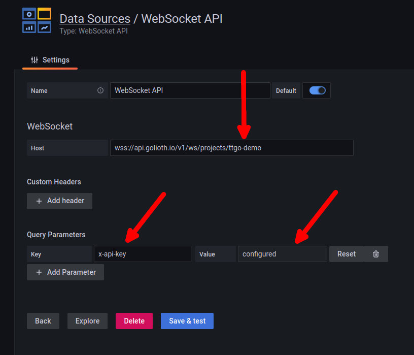
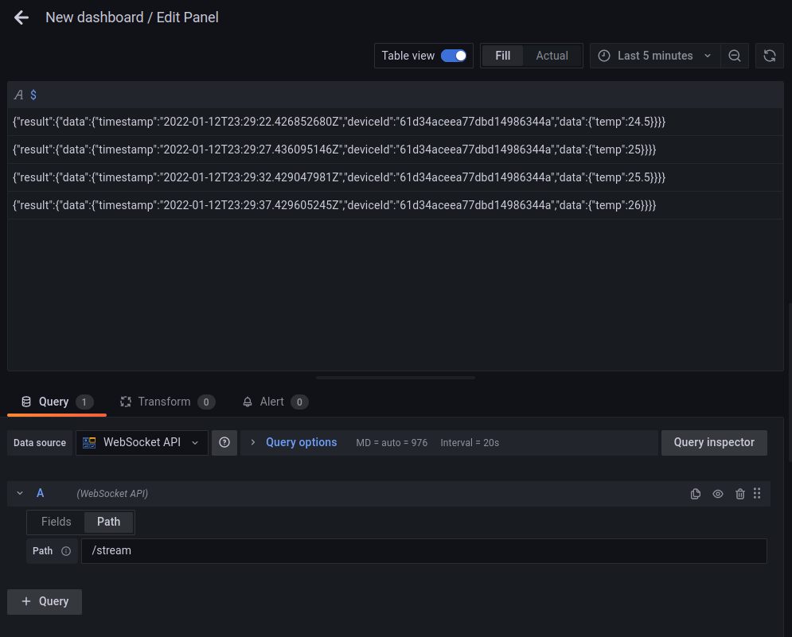

# <a name="commit"></a> Commit Message Format

We have very precise rules over how our Git commit messages must be formatted.
This format leads to **easier to read commit history**.

Each commit message consists of a **header**, a **body**, and a **footer**.

```
<header>
<BLANK LINE>
<body>
<BLANK LINE>
<footer>
```

The `header` is mandatory and must conform to the [Commit Message Header](#commit-header) format.

The `body` is mandatory for all commits except for those of type "docs".
When the body is present it must be at least 20 characters long and must conform to the [Commit Message Body](#commit-body) format.

The `footer` is optional. The [Commit Message Footer](#commit-footer) format describes what the footer is used for and the structure it must have.

#### <a name="commit-header"></a>Commit Message Header

```
<type>: <short summary>
  │             │
  │             └─⫸ Summary in present tense. Not capitalized. No period at the end.
  │
  └─⫸ Commit Type: build|ci|docs|feat|fix|perf|refactor|test
```

The `<type>` and `<summary>` fields are mandatory, the `(<scope>)` field is optional.

##### Type

Must be one of the following:

- **build**: Changes that affect the build system or external dependencies (example scopes: gulp, broccoli, npm)
- **ci**: Changes to our CI configuration files and scripts (examples: CircleCi, SauceLabs)
- **docs**: Documentation only changes
- **feat**: A new feature
- **fix**: A bug fix
- **perf**: A code change that improves performance
- **refactor**: A code change that neither fixes a bug nor adds a feature
- **test**: Adding missing tests or correcting existing tests

##### Summary

Use the summary field to provide a succinct description of the change:

- use the imperative, present tense: "change" not "changed" nor "changes"
- don't capitalize the first letter
- no dot (.) at the end

#### <a name="commit-body"></a>Commit Message Body

Just as in the summary, use the imperative, present tense: "fix" not "fixed" nor "fixes".

Explain the motivation for the change in the commit message body. This commit message should explain _why_ you are making the change.
You can include a comparison of the previous behavior with the new behavior in order to illustrate the impact of the change.

#### <a name="commit-footer"></a>Commit Message Footer

The footer can contain information about breaking changes and deprecations and is also the place to reference GitHub issues, Jira tickets, and other PRs that this commit closes or is related to.
For example:

```
BREAKING CHANGE: <breaking change summary>
<BLANK LINE>
<breaking change description + migration instructions>
<BLANK LINE>
<BLANK LINE>
Fixes #<issue number>
```

or

```
DEPRECATED: <what is deprecated>
<BLANK LINE>
<deprecation description + recommended update path>
<BLANK LINE>
<BLANK LINE>
Closes #<pr number>
```

Breaking Change section should start with the phrase "BREAKING CHANGE: " followed by a summary of the breaking change, a blank line, and a detailed description of the breaking change that also includes migration instructions.

Similarly, a Deprecation section should start with "DEPRECATED: " followed by a short description of what is deprecated, a blank line, and a detailed description of the deprecation that also mentions the recommended update path.

### Revert commits

If the commit reverts a previous commit, it should begin with `revert: `, followed by the header of the reverted commit.

The content of the commit message body should contain:

- information about the SHA of the commit being reverted in the following format: `This reverts commit <SHA>`,
- a clear description of the reason for reverting the commit message.

# Instructions for Building and Running Locally

This is a starting point for building Grafana Data Source Backend Plugins

## What is Grafana Data Source Backend Plugin?

Grafana supports a wide range of data sources, including Prometheus, MySQL, and even Datadog. There’s a good chance you can already visualize metrics from the systems you have set up. In some cases, though, you already have an in-house metrics solution that you’d like to add to your Grafana dashboards. Grafana Data Source Plugins enables integrating such solutions with Grafana.

For more information about backend plugins, refer to the documentation on [Backend plugins](https://grafana.com/docs/grafana/latest/developers/plugins/backend/).

## Getting started

A data source backend plugin consists of both frontend and backend components.

### Install Toolchain

1. Go Language

   The Go language version 1.14 or later is needed. You can install go with `sudo apt install golang-go` but some package managers have older versions. Use `go version` to confirm. If you need to install a newer version, [download the package](https://go.dev/dl/) and install it:

   ```bash
   cd ~
   tar -xvf ~/Downloads/go1.17.6.linux-amd64.tar.gz
   nano ~/.profile
   ```

   Add the following lines to the end of this file:

   ```bash
   export GOPATH=$HOME/go
   export PATH=$PATH:$GOPATH/bin
   ```

   Save the file and load the changes:

   ```bash
   source ~/.profile
   ```

2. Mage

   Install [the Mage build tool](https://github.com/magefile/mage):

   ```bash
   go get -u -d github.com/magefile/mage
   cd $GOPATH/pkg/mod/github.com/magefile/
   chmod 755 mage*
   cd mage*
   go run bootstrap.go
   ```

   We have already step up `$GOPATH\bin` when installing golang. Mage is installed to the same directory.

3. Node.js

   Node.js can be installed using a package manager with the command `sudo apt install nodejs` but often times this is an older version. We need to run `yarn`, which depends on version 14 or greater of Node.js.

   Display your Node version using `node -v`. To move to a newer version, [install the Node Version Manager](https://github.com/nvm-sh/nvm#install--update-script) (`nvm`) and use it to install and switch to a newer version:

   ```bash
   nvm install stable
   nvm use stable
   node -v
   ```

4. Yarn

   Install the Yarn package manager:

   ```bash
   npm install yarn --global
   ```

### Setup Plugin Directory

1. Create directory:

   ```bash
   mkdir -p path/to/your/clone
   ```

2. Clone this repo into the new directory and update to `develop` branch:

   ```bash
   cd path/to/your/clone
   git clone git@github.com:golioth/grafana-websocket-plugin.git .
   git checkout develop
   ```

### Frontend

1. Install plugin dependencies

   ```bash
   cd path/to/your/clone/grafana-websocket-plugin
   yarn install
   ```

2. Build plugin in development mode or run in watch mode

   ```bash
   yarn dev
   ```

   or

   ```bash
   yarn watch
   ```

3. Build plugin in production mode

   ```bash
   yarn build
   ```

   - **Yarn Error**: If yarn throws `opensslErrorStack`, export this value in the terminal and build yarn again:

     ```bash
     export NODE_OPTIONS=--openssl-legacy-provider
     ```

### Backend

1. Update [Grafana plugin SDK for Go](https://grafana.com/docs/grafana/latest/developers/plugins/backend/grafana-plugin-sdk-for-go/) dependency to the latest minor version:

   ```bash
   go get -u github.com/grafana/grafana-plugin-sdk-go
   go mod tidy
   ```

2. Build backend plugin binaries for Linux, Windows and Darwin:

   ```bash
   mage -v
   ```

3. List all available Mage targets for additional commands:

   ```bash
   mage -l
   ```

### Run the Grafana

1. Start the docker container

   ```bash
    docker run \
      --network="host" -e "GF_LOG_MODE=console file" \
      -e "GF_PLUGINS_ALLOW_LOADING_UNSIGNED_PLUGINS=golioth-websocket-datasource" \
      -p 3000:3000 \
      -v path/to/your/clone:/var/lib/grafana/plugins \
      --name=grafana grafana/grafana
   ```

   - Notes regarding Docker:
     - Restart container after first run: `docker start grafana`
     - Restart container after first run as daemon: `docker start grafana`
     - Restart container and show the output: `docker start grafana -a`
     - Stop the container when running as daemon: `docker stop grafana`
     - Remove the container from your system: `docker rm -fv grafana`

2. Load the GUI in your browser:
   - http://localhost:3000
   - user: admin
   - password: admin
   - Grafana will ask you to change the password on first login

### Configure Data Source

1. Add websockets data source in Grafana

   - Click the gear icon on the left sidebar and choose "data sources"
   - Click "Add data source"
   - Scroll to the bottom and chose "WebSocket API" in the "Others" category. (If this entry is not an option, you may have a problem with allowing unsigned sources.)

2. Input WebSocket API information

   

   - WebSocket Host should use this format: `wss://api.golioth.io/v1/ws/projects/{project-id}`
   - Query Parameters key must be `x-api-key`
   - Value will be your API key from the [Golioth Console](https://console.golioth.io/api-keys)

3. Add a panel to Grafana Dashboard

   - Click `+` in the left sidbar. Choose "Dashboard" --> "Add a new panel"
   - In the bottom left, set "Fields" to `$`
   - Click the "Path" tab and set to `/stream`
   - Click the "Table view" toggle at the top of the window
   - Any data currently coming in on your project's lightDB stream will begin showing as JSON

   

### Sample Data Source and Customizing Your Data View

1. [Golioth's light DB stream sample](https://github.com/golioth/zephyr-sdk/tree/main/samples/lightdb_stream) is a perfect data source for this demo. It will provide varying temperatu - Any data currently coming in on your project's lightDB stream will begin showing as JSON

2. Make sure that Table View is turned off and choose "Time series" from the upper right "Visualizations" list.

3. Choose "Last 5 minutes" from the time selection window in the upper right corner of the graph.

   

## Plugin Validation

Every time you modify locally the plugin and desire send this change to be published you can validate it locally before to push. The validation will tell you if there is some kind of non-compliance with the Grafana Plugins Rules.

For example, if you put some relative link in the README or some broken link, the validation will claim to you about them. And you'll need fix all of the claims before the submission.

To perform the local validation you must have the `Make` tool installed so that you can run the Makefile's commands and the Grafana's plugin validator `plugincheck` in order to your validate it.

In the root directory you can find a `Makefile` and it contains two commands:

- **setup**

  Run this command if you don't have installed yet the `plugincheck` tool in order to install it.

- **validate-plugin**

  Run this command after have installed the plugincheck. It will prepare and perform the plugin validation.

To run the commands go to the terminal and goes to the plugin's root directory:

```
cd path/to/your/clone/grafana-websocket-plugin
```

Next, install the plugin validator

```
make setup
```

Finally, run the validator:

```
make validate-plugin
```

Case the validator realizes some error or warning in your plugin, it will generate in your terminal some kind of output like the following:

```
.
.
.

plugincheck ./golioth-websocket-datasource.zip || true
{
  "level": "error",
  "message": "Unsigned plugin",
  "details": "Since Grafana 7.3, we require all plugins to be signed. For more information on how to sign your plugin, refer to [Sign a plugin](https://grafana.com/docs/grafana/latest/developers/plugins/sign-a-plugin/)."
}
.
.
.
```

You'll need verify each error or warning and solve them before pushing the plugin.

## Learn more

- [Build a data source backend plugin tutorial](https://grafana.com/tutorials/build-a-data-source-backend-plugin)
- [Grafana documentation](https://grafana.com/docs/)
- [Grafana Tutorials](https://grafana.com/tutorials/) - Grafana Tutorials are step-by-step guides that help you make the most of Grafana
- [Grafana UI Library](https://developers.grafana.com/ui) - UI components to help you build interfaces using Grafana Design System
- [Grafana plugin SDK for Go](https://grafana.com/docs/grafana/latest/developers/plugins/backend/grafana-plugin-sdk-for-go/)
