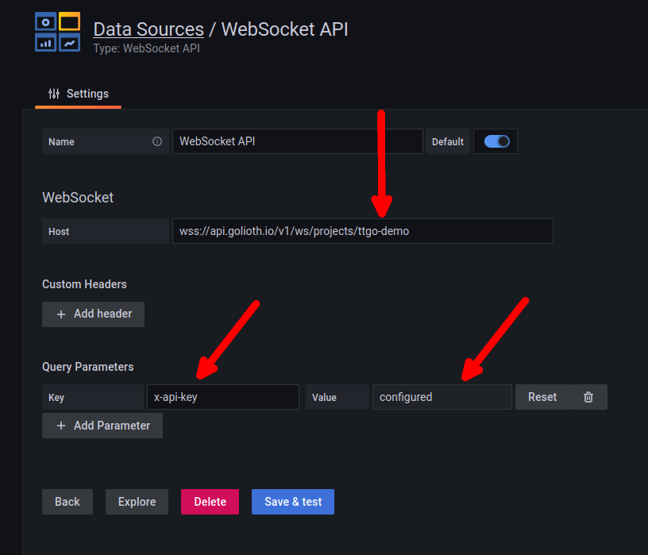
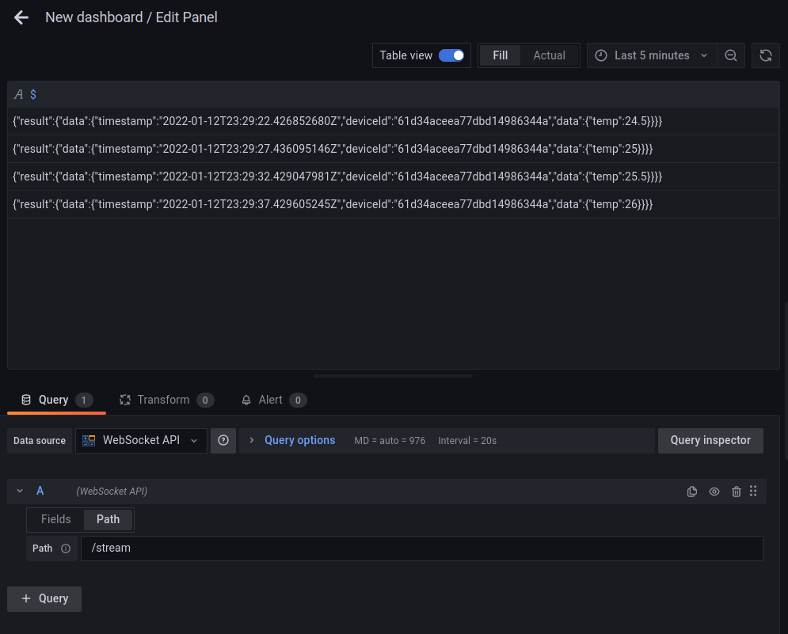
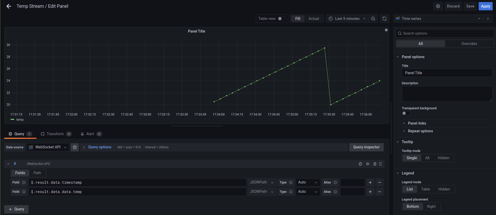

# Grafana Data Source Backend Plugin Template

[](https://github.com/grafana/grafana-datasource-backend/actions?query=workflow%3A%22CI%22)

This template is a starting point for building Grafana Data Source Backend Plugins

## What is Grafana Data Source Backend Plugin?

Grafana supports a wide range of data sources, including Prometheus, MySQL, and even Datadog. There’s a good chance you can already visualize metrics from the systems you have set up. In some cases, though, you already have an in-house metrics solution that you’d like to add to your Grafana dashboards. Grafana Data Source Plugins enables integrating such solutions with Grafana.

For more information about backend plugins, refer to the documentation on [Backend plugins](https://grafana.com/docs/grafana/latest/developers/plugins/backend/).

## Getting started

A data source backend plugin consists of both frontend and backend components.

### Setup Plugin Directory

1. Create directory:

   ```bash
   mkdir -p ~/Golioth/Codes/grafana-plugins/grafana-websocket-plugin
   ```

2. Clone this repo into the new directory and update to `develop` branch:
   
   ```bash
   cd ~/Golioth/Codes/grafana-plugins/grafana-websocket-plugin
   git clone git@github.com:golioth/grafana-websocket-plugin.git .
   git checkout develop
   ```

### Frontend

1. Install dependencies

   ```bash
   yarn install
   ```

2. Build plugin in development mode or run in watch mode

   ```bash
   yarn dev
   ```

   or

   ```bash
   yarn watch
   ```

3. Build plugin in production mode

   ```bash
   yarn build
   ```

### Backend

1. Update [Grafana plugin SDK for Go](https://grafana.com/docs/grafana/latest/developers/plugins/backend/grafana-plugin-sdk-for-go/) dependency to the latest minor version:

   ```bash
   go get -u github.com/grafana/grafana-plugin-sdk-go
   go mod tidy
   ```

2. Build backend plugin binaries for Linux, Windows and Darwin:

   ```bash
   mage -v
   ```

3. List all available Mage targets for additional commands:

   ```bash
   mage -l
   ```

### Run the Grafana

1. Start the docker container

   ```bash
   docker run -d --network="host" -e "GF_LOG_MODE=console file" -e "GF_PLUGINS_ALLOW_LOADING_UNSIGNED_PLUGINS=golioth-websocket-datasource" -p 3000:3000 -v ~/Golioth/Codes/grafana-plugins:/var/lib/grafana/plugins --name=grafana grafana/grafana
   ```

2. Load the GUI in your browser:
   * [http://localhost:3000](http://localhost:3000)
   * user: admin
   * password: admin
   * Grafana will ask you to change the password on first login

### Configure Data Source

1. Add websockets data source in Grafana
   * Click the gear icon on the left sidebar and choose "data sources"
   * Click "Add data source"
   * Scroll to the bottom and chose "WebSocket API" in the "Others" category. (If this entry is not an option, you may have a problem with allowing unsigned sources.)

2. Input WebSocket API information

   

   * WebSocket Host should use this format: `wss://api.golioth.io/v1/ws/projects/{project-id}`
   * Query Parameters key must be `x-api-key`
   * Value will be your API key from the [Golioth Console](https://console.golioth.io)

3. Add a panel to Grafana Dashboard

   * Click `+` in the left sidbar. Choose "Dashboard" --> "Add a new panel"
   * In the bottom left, set "Fields" to `$`
   * Click the "Path" tab and set to `/stream`
   * Click the "Table view" toggle at the top of the window
   * Any data currently coming in on your project's lightDB stream will begin showing as JSON

   

### Sample Data Source and Customizing Your Data View

1. [Golioth's light DB stream sample](https://github.com/golioth/zephyr-sdk/tree/main/samples/lightdb_stream) is a perfect data source for this demo. It will provide varying temperature values for Grafana to graph

2. Use two Field values to choose how the data is graphed (use the `+` on the right of the Field entry to add a second key):

   * `$.result.data.timestamp`
   * `$.result.data.data.temp`

3. Choose "Time series" from the upper right "Visualizations" list.

   

## Learn more

- [Build a data source backend plugin tutorial](https://grafana.com/tutorials/build-a-data-source-backend-plugin)
- [Grafana documentation](https://grafana.com/docs/)
- [Grafana Tutorials](https://grafana.com/tutorials/) - Grafana Tutorials are step-by-step guides that help you make the most of Grafana
- [Grafana UI Library](https://developers.grafana.com/ui) - UI components to help you build interfaces using Grafana Design System
- [Grafana plugin SDK for Go](https://grafana.com/docs/grafana/latest/developers/plugins/backend/grafana-plugin-sdk-for-go/)
